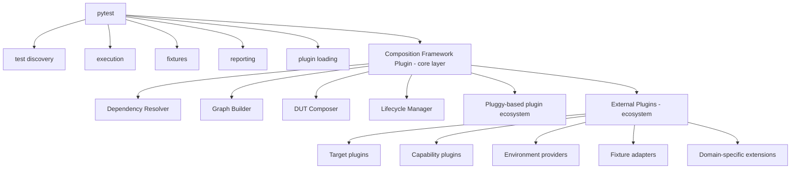

# Composable Test Ecosystem Design (Pytest-Hosted Composition Engine)

## Overview

This document describes a plugin-driven test framework architecture built on top of pytest.
The key idea is to treat pytest purely as an execution engine, while all system composition, environment setup, and capability resolution are handled by an independent deterministic composition layer.

The framework enables:

- Fully decoupled **targets**
- Fully decoupled **capability plugins**
- Fully decoupled **environment providers**
- Deterministic runtime **graph resolution**
- Seamless integration into **pytest fixtures and lifecycle**
- Extensible ecosystem without core schema coupling

---

## Core Principle

The system is built on a strict separation:

> **The engine defines how things compose, not what things are.**

No domain concepts (CAN, SSH, DoIP, etc.) exist in the core framework.

Instead, plugins introduce all domain-specific semantics.

---

## High-Level Architecture



---

## Fundamental Design Shift

### ❌ Traditional approach

- Target defines supported capabilities
- Plugins hardcode compatibility with target classes
- Tight coupling between test infrastructure and domain objects

### ❌ Intermediate flawed abstraction

- Central `Fact` base class
- Framework must know all possible fact types
- Still creates schema coupling at core level

### ✅ Final approach

- The framework is completely **semantic-agnostic**
- Plugins define all domain semantics
- Composition is driven by **opaque descriptors + dependency resolution**

---

## Core Abstractions

### 1. Descriptor (Opaque Unit of Contribution)

Plugins contribute arbitrary descriptors into a global graph.

```python
@dataclass
class Descriptor:
    key: Any              # opaque identifier
    value: Any            # opaque payload
    metadata: dict        # optional hints for resolution/debugging
```

The engine never interprets `value`.

---

### 2. Contract-Based Composition

Plugins declare:

- what they provide
- what they require

```python
@provides("transport/can")
def can_transport(...):
    ...

@requires("transport/can")
def can_client(can_transport):
    ...
```

The framework only understands string (or typed) keys.

---

### 3. Target Model (Fact Publisher)

A target does not declare capabilities.

It publishes descriptors:

```text
target.descriptors()
```

Example:

```text
transport/can
transport/doip
endpoint/ssh
network/interface
```

A target is just a source of facts.

---

### 4. Capability Plugins (Consumers + Producers)

Plugins are pure transformations:

input descriptors -> output resources

Example:

```text
DoIP plugin:
  requires: transport/doip
  provides: doip/client

UDS plugin:
  requires: doip/client
  provides: uds/client
```

Plugins never know about targets.

---

### 5. Environment Plugins

Environment providers contribute infrastructure resources:

- Docker network
- Certificates
- Serial bridges
- Logging systems

They follow the same contract model:

```python
provides("env/network")
provides("env/certificate")
```

---

## Dependency Resolution Engine

The engine performs deterministic graph resolution.

Steps:

1. Collect all target descriptors
2. Collect all plugin providers
3. Build dependency graph:

requires -> provides

4. Resolve execution order
5. Instantiate resources
6. Compose DUT object
7. Expose pytest fixtures

---

## Determinism Guarantee

Given the same:

```text
plugins
target descriptors
configuration
```

The engine always produces the same:

```text
dependency graph
resolution order
DUT composition
```

---

## DUT (Device Under Test)

The DUT is the runtime composition result.

It is not predefined.

It is built dynamically:

```python
dut.require("uds/client")
dut.require("ssh/client")
dut.require("can/client")
```

It is a view over the resolved graph.

---

## Pytest Integration Layer

Pytest is used only as execution host.

Responsibilities:

- Test discovery
- Fixture injection
- Execution lifecycle
- Reporting
- Parallel execution (xdist)

---

## Framework Plugin Hooks into Pytest

The framework registers its own plugin:

```python
pytest_configure(config)
pytest_sessionstart(session)
pytest_generate_tests(metafunc)
pytest_fixture_setup(...)
```

At session start:

```text
resolve composition graph
build DUT
publish fixtures
```

---

## Fixture Bridge

Resolved resources are exposed as fixtures:

```python
@pytest.fixture
def ssh(dut):
    return dut.require("ssh/client")
```

Or dynamically generated:

- ssh
- uds
- doip
- can

Test usage:

```python
def test_flash(uds, ssh):
    ...
```

---

## Plugin Ecosystem

### 1. Target Plugins

Define systems under test.

- ECU
- Simulator
- Container
- Hardware device

They only emit descriptors.

---

### 2. Capability Plugins

Transform descriptors into usable clients.

- SSH client
- DoIP client
- UDS stack
- HTTP API client

They consume + produce resources.

---

### 3. Environment Plugins

Provide infrastructure:

- network setup
- docker runtime
- certificates
- logging pipelines

---

### 4. Adapter Plugins

Bridge into frameworks:

- pytest fixture adapter
- CLI adapter
- REST API adapter
- CI integration adapter

---

## Key Insight: No Shared Domain Model

There is:

- No global "CAN class"
- No global "SSH class"
- No required schema in core

Instead:

- Contracts are string or opaque keys
- Payloads are plugin-owned
- Resolution is structural, not semantic

---

## Why This Works

1. Maximum decoupling

Plugins do not depend on each other.

2. Extensibility

New domains require no core changes.

3. Deterministic composition

Same inputs always produce same runtime graph.

4. Pytest compatibility

No need to replace execution engine.

5. Ecosystem scalability

Any vendor can add plugins without coordination.

---

## Mental Model

Think of the system as:

> A dependency injection container for test environments

- a graph resolver
- a plugin ecosystem
- pytest as runtime host

---

## Summary

The final architecture is:

- Targets publish opaque descriptors
- Plugins consume/produce descriptors
- Engine resolves dependency graph deterministically
- DUT is a runtime composition of resolved resources
- pytest executes tests against the DUT via fixtures

The core framework remains completely unaware of domain concepts, enabling an open plugin ecosystem where any new technology can integrate without modifying the core system.
