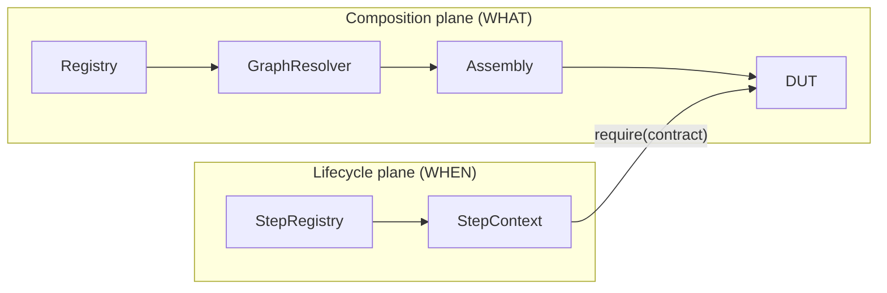
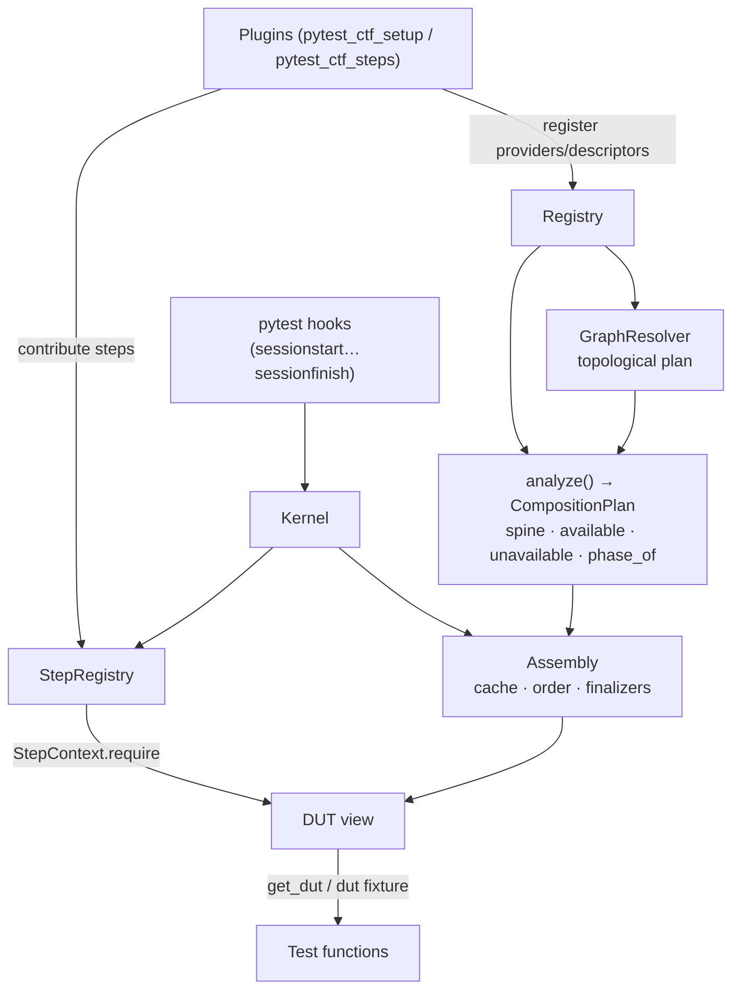
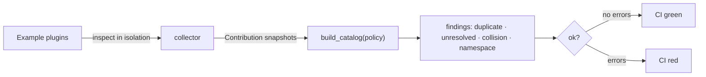

# CTF — the Composition Test Framework

> A contract-based composition engine for integration testing. Tests declare the
> **capabilities** they need; the engine assembles whatever target can provide
> them, brings it up in the right order, and tears it down cleanly — on a mock,
> a subprocess, a container, or real hardware, **without the test changing**.

---

## 1. Why this exists

Integration testing is messy. Hardware needs to be acquired, connected,
provisioned, and only then is it *ready*. Sometimes it needs to be reset,
reflashed, or reprovisioned **mid-run**. Different targets expose different
capabilities. A test that hard-codes "docker" or "ssh" rots the moment the lab
changes.

CTF removes the target from the test. A test depends only on **contracts**
(`ctf/cap/exec`, `ctf/scenario/echo`, …). The engine:

1. **collects** what every plugin can contribute,
2. **resolves** a deterministic dependency graph for the requested contracts,
3. **composes** a Device-Under-Test (DUT) by instantiating providers in
   dependency order,
4. **drives** the target up a fixed readiness ladder and tears it back down,
5. **adapts**: a capability the composed target cannot satisfy makes the
   depending test *skip*, not the whole suite *fail*.

The engine is deliberately **semantic-agnostic**: it never knows what "flash" or
"provision" *means*. It only knows how to order, build, and unwind contracts.
Meaning lives in plugins. Governance (a separate, optional layer) keeps that
freedom honest.

---

## 2. The two planes

CTF separates two orthogonal questions that most frameworks tangle together:

| Plane | Question | Module | Primitive |
| --- | --- | --- | --- |
| **Composition** ("WHAT") | *What resources exist and how do they depend on each other?* | `dut.py`, `assembly.py`, `resolver.py`, `registry.py`, `contracts.py` | **Provider / Descriptor** |
| **Lifecycle** ("WHEN") | *When, during pytest's run, does work happen?* | `steps.py`, `pytest_plugin.py` | **Step / Extension point** |

The two planes meet in exactly one place — the `StepContext`, which hands a step
a `require(contract)` bridge back into the composition plane.



---

## 3. Core concepts

### 3.1 Contracts
A **contract** is just a string name — a capability promise, not a class. Tests
and providers refer to each other only through contracts, so any implementation
that satisfies a contract is swappable.

Reserved framework contracts use the `ctf/*` namespace:

```
ctf/target            the bring-up anchor (the generic target handle)
ctf/host/process      host-side process runner (infrastructure)
ctf/cap/exec          run a command -> (code, bytes)
ctf/cap/file_transfer upload() / download()
ctf/cap/restart       restart()
ctf/cap/network       ip() / gateway()
ctf/cap/ping          derived: ping the target from the host
ctf/scenario/echo     derived: echo a payload over a shell
ctf/net/ssh_endpoint  an SSH endpoint fact
ctf/sec/token         a deployed credential
```

### 3.2 Providers & Descriptors
- A **Provider** is a pure transformation `requires… -> produces one contract`.
  Declared with decorators; dependencies are injected **positionally in
  `@requires` order** (no name-guessing). A generator provider's post-`yield`
  body runs at teardown, exactly like a pytest yield-fixture.
- A **Descriptor** is a leaf *fact* — a value with no dependencies (an IP, an
  image name, a token id).

```python
from ctf.contracts import provides, requires

@provides("ctf/cap/exec")
@requires("ctf/target")
def exec_capability(target) -> Exec:
    return _Exec(target)

@provides("docker/container", phase="ACQUIRED")
@requires("docker/image", "docker/config")
def docker_container(image, config):
    container = start(image, config)
    try:
        yield container          # live for the whole session
    finally:
        container.remove()       # reverse-order teardown
```

The **Registry** enforces single-source-of-truth: a contract is owned by exactly
one provider *or* one descriptor — never both, never duplicated.

### 3.3 Phases — the readiness ladder
A resource's `phase` says *when it becomes ready during bring-up*. The ladder is
engine-fixed and domain-free:

```
DECLARED  →  ACQUIRED  →  CONNECTED  →  PROVISIONED  →  READY
(facts)      (exists)     (reachable)   (credentialed)   (test-facing)
```

The one rule: **an earlier-phase provider may not require a later-phase
contract** (no forward references on the ladder). Untagged providers default to
`READY`, so an ecosystem that ignores phases behaves exactly as before.

> There is intentionally **no scope axis**. The kernel owns a single timeline —
> the session. Every resolved resource lives for the whole assembly. Want a
> fresh-per-test object? Wrap the resolved resource in an ordinary pytest
> fixture. Per-test lifetime is a pytest concern, not a kernel concern.

### 3.4 The spine, the anchor, and run modes
- The **anchor** is `ctf/target` (`TARGET_ANCHOR`). Whatever target is composed
  publishes it.
- The **spine** is the `@requires` closure rooted at the anchor — the mandatory
  bring-up path. It **must** resolve, in every mode.
- Everything outside the spine is **additive** (extra capabilities).

`RunMode` governs only additive capabilities:

| Mode | Spine unmet | Additive unmet |
| --- | --- | --- |
| `STRICT` | run aborts | run aborts |
| `LOOSE` *(default)* | run aborts | recorded *unavailable* → depending tests **skip** |

Reconciliation: with **no anchor** there is no declared spine, so `LOOSE`
behaves like `STRICT` (every provider must resolve). This is what lets a
capability be absent on one target and present on another **without any
self-gating logic in the plugin** — availability is a graph fact decided by the
graph + mode, not by hand-rolled `registry.has(...)` guards.

---

## 4. Component breakdown & how they communicate



| Component | Responsibility | Talks to |
| --- | --- | --- |
| **`contracts.py`** | `@provides` / `@requires` decorators; `Provider`; `PHASES`. | Registry (build_provider) |
| **`descriptor.py`** | Leaf facts (`Descriptor(key, value)`). | Registry |
| **`registry.py`** | Single-source-of-truth collection of providers + descriptors. | Resolver, Assembly |
| **`resolver.py`** | Deterministic, side-effect-free topological **plan** (deps first). Detects cycles + unresolved contracts. | Registry |
| **`phases.py`** | `phase_of_contract`, `validate_phases` (no forward refs). | Assembly, DUT |
| **`assembly.py`** | The **only** lifecycle owner: `analyze()` → `CompositionPlan`; `Assembly` holds the session cache, instantiation `_order`, and `_finalizers`; lazy `get()`, eager `advance_through_phases()`, `reapply()`, reverse-order teardown. | Resolver, lifecycle, DUT |
| **`lifecycle.py`** | `instantiate_provider(provider, args) -> (value, finalizer)` — the one place generator vs. plain factories are handled. | Assembly |
| **`dut.py`** | The `DUT` **view** (`require`, `available`, `provides`, `materialized`); `build_manager()`, `compose()`. | Assembly |
| **`steps.py`** | Lifecycle plane: `Step`, `StepRegistry`, `Policy` (FANOUT/FIRST/UNIQUE), `StepContext`, `ArtifactSink`. | pytest_plugin, DUT |
| **`pytest_plugin.py`** | The **adapter**: `Kernel`, the two hookspecs, and the mapping from pytest hooks → CTF points. | everything |
| **`diagnostics.py`** | Human-sourced error rendering + phase-walk narration. | pytest_plugin |
| **`errors.py`** | Typed error hierarchy (see below). | all |
| **`target.py`** | `TARGET_ANCHOR`, `Target` / `DescriptorTarget`. | Assembly, registry |

### 4.1 The lifecycle plane & extension points
Plugins contribute **steps** to named **extension points**, each with a policy:

- `FANOUT` — run every step (deterministic order), collect all results.
- `FIRST` — run in order, stop at the first non-`None`.
- `UNIQUE` — exactly one step allowed; more is a hard error.

The engine defines only generic points and binds them to pytest's real hooks —
**it rides pytest, it does not invent a parallel driver**:

```
pytest_sessionstart       → ctf_provision (UNIQUE) + ctf_session_setup (FANOUT)
pytest_runtest_setup      → ctf_before_test (FANOUT)
pytest_runtest_makereport → ctf_collect (FANOUT, on the "call" phase)
pytest_runtest_teardown   → ctf_after_test (FANOUT, reverse)
pytest_sessionfinish      → ctf_session_teardown (FANOUT, reverse) + Assembly.exit()
```

### 4.2 Error boundary
Composition happens at `pytest_sessionstart`. Any structural problem is turned
into a **clean** `pytest.UsageError` (sourced diagnostic), never an
`INTERNALERROR` traceback:

```
CompositionError            base for structural faults
├─ UnresolvedContractError  a required contract nobody provides
├─ DuplicateProviderError   two sources for one contract
├─ KeyCollisionError        a contract is both descriptor and provider
├─ CyclicDependencyError    a cycle on the graph
├─ PhaseViolation           a forward reference on the ladder
├─ StepCollisionError       >1 step on a UNIQUE point
└─ StepExecutionError       a plugin step raised (attributed to the plugin)

CapabilityUnavailableError  (NOT a CompositionError) — an additive cap that was
                            marked unavailable in LOOSE mode; the adapter turns
                            it into a test skip.
```

---

## 5. Re-entrancy — because real hardware breaks

`Assembly` is a **re-drivable state machine**, not a one-shot builder. Mid-run
recovery (reset / reflash / reprovision) is first-class:

```python
assembly.advance_through_phases(up_to="READY")   # walk the ladder, narrated

assembly.reapply("PROVISIONED", cascade=False)   # redo just this rung in place
assembly.reapply("ACQUIRED",    cascade=True)     # tear down this rung AND
                                                  # everything above it (reverse
                                                  # order, no stale handles),
                                                  # then re-walk to the top
```

`cascade=True` guarantees no resource built *over* a now-reflashed box survives
the reflash — it is torn down in reverse instantiation order and rebuilt.

---

## 6. Capability taxonomy (domain examples)

The example ecosystem (`itf/examples/examples/ctf/`) demonstrates four shapes of
capability — all resolved by the graph, **none self-gating**:

| Kind | Shape | Example |
| --- | --- | --- |
| **1. Target-owned** | `@requires(ctf/target)` | `exec`, `file_transfer`, `restart`, `network` on each target |
| **2. Env-provided** | `@requires` host infrastructure | `ping` (needs `ctf/host/process` + the target's `ctf/cap/network`) |
| **3. Cap-requires-cap** | a capability derived from another | `ssh` exec `@requires(ssh_endpoint, token)`; `echo` `@requires(ctf/cap/exec)` |
| **4. Conditional** | present on some targets, absent on others | `network`/`ping` absent on mock & subprocess → tests **skip**; present on docker → tests **run** |

### The targets
- **mock** — in-process fakes (fastest; no network → ping/echo-over-network skip)
- **subprocess** — real host shell (no isolation, no network identity)
- **docker** — a real container (publishes *every* capability, including network)

Each target publishes `ctf/target` at the `ACQUIRED` phase; capabilities attach
above it. Swap the target, keep the tests.

### The levels (each a self-contained pytest rootdir)
```
levels/integration   target-agnostic capability tests   --ctf-target=mock|subprocess|docker
levels/scenario      derived ctf/scenario/echo tests     --ctf-target=…
levels/ssh_demo      SSH-over-credential                 --ssh-target=sealed_a|sealed_b
levels/docker        docker-only behaviour (bind mount, network identity)
```

`ssh_demo` shows the same SSH plugin serving two sealed targets whose credential
requirement is satisfied **differently** (a deployed token vs. anonymous) — the
choice lives in the *target composition*, not in plugin introspection.

---

## 7. The layered architecture

```
Layer 0  PYTEST            the execution host (owns the run)
Layer 1  ADAPTER           pytest_plugin.py — thin; maps hooks ↔ CTF points
Layer 2  CTF KERNEL        pytest-free; finishes composing BEFORE the first test
Layer 3  PLUGINS           targets, capabilities, scenarios, security
Layer 4  PRODUCT           the actual system under test
```

The kernel owns only the phases it defines (bring-up), never the *test* phase.
The kernel is import-clean of pytest below Layer 1, so it is usable
programmatically via `compose()`:

```python
from ctf import compose
with compose(registry) as dut:
    shell = dut.require("ctf/cap/exec")
    assert shell.execute("echo hi")[0] == 0
```

---

## 8. Governance — keeping the freedom honest

Because any plugin can contribute any contract, an optional, **one-way-dependent**
governor (`FrameWorkRevampGovernance`, package `ctf_governance`) audits an
assembled ecosystem *without executing it*:

- **Namespacing** — enforce `<org>/<domain>/<name>`; bless reserved names.
- **Catalog / discovery** — who provides & requires what, at which phase.
- **Breakage detection** — duplicate providers, key collisions, **dangling
  requirements** (a renamed/typo'd contract), UNIQUE-point collisions.

The demo `tests/test_scenario_contract_demo.py` audits the **real** example
ecosystem: the healthy graph audits clean (the contract baseline), and every
deliberate violation — a duplicate provider, a scenario written against a
renamed contract, a mis-namespaced name — is caught. Wire that audit into CI and
a contract regression fails the build instead of shipping.



> Dependency direction is one-way: `ctf-governance` depends on `ctf`; `ctf`
> never depends on `ctf-governance`.

---

## 9. Assumptions

1. **pytest is the host.** CTF rides pytest's real lifecycle; it does not fork a
   parallel scheduler. (The kernel itself is pytest-free and usable via
   `compose()`.)
2. **One session timeline.** No scope axis. Every resource lives for the run;
   per-test freshness is a pytest fixture concern.
3. **Contracts are the only coupling.** Tests never name targets. A capability is
   a contract, not a flag on a target object.
4. **Positional injection.** Dependencies are injected in `@requires` order, not
   by parameter name.
5. **Single source of truth.** A contract is owned by exactly one provider *or*
   one descriptor.
6. **Availability is a graph fact.** No plugin self-gates on `registry.has(...)`;
   loose mode + graph position decides what is available, and absent additive
   capabilities skip their tests.
7. **Determinism.** For a fixed registry + requested contract, the resolution
   plan is always identical.
8. **Failures stop cleanly.** Structural problems become sourced
   `UsageError`s at session start, before any test runs.

---

## 10. Verify

```bash
# Core engine + inline ecosystem
cd FrameWorkRevamp && .venv/bin/python -m pytest tests examples -q            # 77 passed

# Governance (incl. the real-ecosystem contract guard)
cd FrameWorkRevampGovernance \
  && ../FrameWorkRevamp/.venv/bin/python -m pytest -q                          # 30 passed

# Example levels (from itf/examples/examples/ctf/levels/<level>)
PY=../../../../FrameWorkRevamp/.venv/bin/python
$PY -m pytest --ctf-target=mock -q         # integration: 4 passed, 2 skipped
$PY -m pytest --ctf-target=docker -q       # integration: 6 passed (network+ping run)
$PY -m pytest --ctf-target=subprocess -q   # scenario:    3 passed
$PY -m pytest --ssh-target=sealed_a -q     # ssh_demo:    2 passed
```

---

## 11. File map

```
src/ctf/
├── contracts.py     @provides/@requires, Provider, PHASES        (WHAT: primitives)
├── descriptor.py    leaf facts
├── registry.py      single-source-of-truth collection
├── resolver.py      deterministic topological plan
├── phases.py        readiness-ladder validation
├── target.py        TARGET_ANCHOR + Target
├── lifecycle.py     instantiate_provider (generator/teardown handling)
├── assembly.py      RunMode · CompositionPlan · analyze() · Assembly   (the driver)
├── dut.py           DUT view · build_manager() · compose()
├── steps.py         Step · StepRegistry · Policy · StepContext    (WHEN: lifecycle)
├── pytest_plugin.py Kernel · hookspecs · pytest↔CTF mapping       (the adapter)
├── diagnostics.py   sourced error + phase-walk narration
└── errors.py        typed error hierarchy
```
